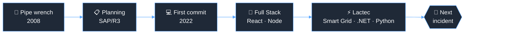

<table align="right">
 <tr align="center"><td><a href="https://github.com/igorjba/igorjba/blob/main/readme-en.md">:us: English</a></td></tr>
 <tr align="center"><td><a href="https://github.com/igorjba/igorjba/blob/main/readme.md">:brazil: Portuguese</a></td></tr>
</table>

  
  
  

---

### 👋 About

I started my career with a pipe wrench in hand, maintaining pumps and compressors at Transpetro/Petrobras terminals. That was about 8 years in critical industrial environments. The lesson that stuck with me: a good system is a system that doesn't go down.

Today I work at the [Lactec Research Institute](https://www.linkedin.com/company/lactec/), modernizing high-criticality enterprise platforms. I build interfaces decoupled from legacy systems, backends in C#/.NET, Python and Node, and integrate distributed ecosystems with federated auth. I think about failure and observability before they turn into incidents.

Outside the code, I've been organizing GDG Salvador since 2023. Between 2023 and 2024 I was also an organizer at DevOpsDays Salvador, where I contributed to the event's international website, an open source project built with Go/Hugo.

 

### 🔀 The career, as a pipeline

 

### 🛠️ What I'm working on

- International projects in the **Landis+Gyr** ecosystem: smart metering applications used globally, across AMI, RF Mesh and DLMS/COSEM environments.
- Legacy modernization: new Next.js/TypeScript interfaces, decoupled from the old systems, without stopping operations.
- Enterprise integrations: REST APIs, Keycloak/JWT, multiple services and plenty of distributed systems troubleshooting.
- Studying distributed architecture and observability.

 

### 🧰 Stack

<table>
  <tr>
    <td><b>Frontend</b></td>
    <td>
      
      
      
      
    </td>
  </tr>
  <tr>
    <td><b>Backend</b></td>
    <td>
      
      
      
      
      
      
    </td>
  </tr>
  <tr>
    <td><b>Data</b></td>
    <td>
      
      
      
      
    </td>
  </tr>
  <tr>
    <td><b>Infra & Auth</b></td>
    <td>
      
      
      
      
      
    </td>
  </tr>
  <tr>
    <td><b>Community & OSS</b></td>
    <td>
      
      
    </td>
  </tr>
  <tr>
    <td><b>Domain</b></td>
    <td>
      Smart Grid · AMI · RF Mesh · DLMS/COSEM · Distributed architecture · SAP/R3 · Operational reliability
    </td>
  </tr>
</table>

 

### 💡 Some highlights

| | |
|---|---|
| ⚡ **Landis+Gyr / Smart Grid** | Smart metering applications used globally, built with multinational teams. |
| ♻️ **Salvador Carnival recycling** | Traceability and logistics monitoring platform for the operation. Around 140 tons of waste recycled and international recognition at Climate Week NYC. |
| 🏭 **Transpetro / Petrobras** | About 8 years planning maintenance for thousands of critical assets via SAP/R3, where equipment downtime is expensive. |
| 🎤 **GDG Salvador** | Organizer since 2023: DevFest, Google I/O Extended, Build With AI and technical meetups. |
| 🐹 **DevOpsDays Salvador** | Organizer between 2023 and 2024. Contributed to the event's international website ([devopsdays.org](https://www.devopsdays.org)), an open source project built with Go/Hugo. |

 

  
<b>🚨 Postmortem: INC-2022-001</b>

   

  **Severity:** P1 · **Status:** resolved · **Exposure time:** ~14 years

  **Summary**
  During a routine preventive maintenance, the mechanic on duty noticed he enjoyed automating the maintenance report more than doing the maintenance.

  **Impact**
  An entire career redirected. No centrifugal pump was harmed in the process.

  **Root cause**
  Prolonged exposure to legacy systems and spreadsheets with business rules hidden inside them. The operator realized all of that could be code, and there was no going back.

  **Timeline**
  `2008` first contact with a critical asset
  `2013` realizes SAP has logic, and that logic can be written
  `2022` first commit
  `2024` returns to the power sector, now from the keyboard side

  **Action items**
  - [x] Learn to code
  - [x] Trade the pipe wrench for a keyboard
  - [x] Bring the uptime obsession along for the move
  - [ ] Stop thinking about failure modes before falling asleep (won't fix: it's a feature)

  
<b>📊 GitHub stats</b>

   
  

    
    
  

  
<b>🎓 Education & certifications</b>

   

  - **Systems Analysis and Development** — [UNIFACS](https://www.unifacs.br/) · 2022 to 2025
  - **Software Development** — [Cubos Academy](https://cubos.academy/cursos/desenvolvimento-de-software) · 2022 to 2023
  - **Mechanical Technician** — Centro de Formação Técnica da Bahia · 2010 to 2011

  Certifications: JavaScript Developer · Python (IBM) · Uncomplicating DevOps · Agile Explorer
    
  Languages: Portuguese (native) · English (professional) · Spanish (basic)

 

---

<b>SYSTEM STATUS</b>
 

  

**Open to talk about distributed systems, platform modernization and enterprise integrations.**

  

<i>ars gratia gattis</i>

  

