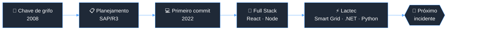

<table align="right">
 <tr align="center"><td><a href="https://github.com/igorjba/igorjba/blob/main/readme-en.md">:us: English</a></td></tr>
 <tr align="center"><td><a href="https://github.com/igorjba/igorjba/blob/main/readme.md">:brazil: Português</a></td></tr>
</table>

  
  
  

---

### 👋 Sobre

Comecei minha carreira com uma chave de grifo na mão, fazendo manutenção de bombas e compressores em terminais da Transpetro/Petrobras. Foram uns 8 anos em ambiente industrial crítico. A lição que ficou dessa época: sistema bom é sistema que não cai.

Hoje trabalho no [Instituto de Pesquisa Lactec](https://www.linkedin.com/company/lactec/), modernizando plataformas enterprise de alta criticidade. Construo interfaces desacopladas de sistemas legados, backends em C#/.NET, Python e Node, e integro ecossistemas distribuídos com autenticação federada. Penso em falha e observabilidade antes de virarem incidente.

Fora do código, organizo o GDG Salvador desde 2023. Entre 2023 e 2024 também fui organizador do DevOpsDays Salvador, onde contribuí com o site internacional do evento, um projeto open source em Go/Hugo.

 

### 🔀 A trajetória, como pipeline

 

### 🛠️ O que ando fazendo

- Projetos internacionais do ecossistema **Landis+Gyr**: aplicações de medição inteligente usadas globalmente, em ambientes AMI, RF Mesh e DLMS/COSEM.
- Modernização de legado: interfaces novas em Next.js/TypeScript, desacopladas dos sistemas antigos, sem parar a operação.
- Integrações enterprise: APIs REST, Keycloak/JWT, múltiplos serviços e bastante troubleshooting de sistema distribuído.
- Estudando arquitetura distribuída e observabilidade.

 

### 🧰 Stack

<table>
  <tr>
    <td><b>Frontend</b></td>
    <td>
      
      
      
      
    </td>
  </tr>
  <tr>
    <td><b>Backend</b></td>
    <td>
      
      
      
      
      
      
    </td>
  </tr>
  <tr>
    <td><b>Dados</b></td>
    <td>
      
      
      
      
    </td>
  </tr>
  <tr>
    <td><b>Infra & Auth</b></td>
    <td>
      
      
      
      
      
    </td>
  </tr>
  <tr>
    <td><b>Comunidade & OSS</b></td>
    <td>
      
      
    </td>
  </tr>
  <tr>
    <td><b>Domínio</b></td>
    <td>
      Smart Grid · AMI · RF Mesh · DLMS/COSEM · Arquitetura distribuída · SAP/R3 · Confiabilidade operacional
    </td>
  </tr>
</table>

 

### 💡 Alguns marcos

| | |
|---|---|
| ⚡ **Landis+Gyr / Smart Grid** | Aplicações de medição inteligente usadas globalmente, construídas com equipes multinacionais. |
| ♻️ **Reciclagem do Carnaval de Salvador** | Plataforma de rastreabilidade e monitoramento logístico da operação. Cerca de 140 toneladas de resíduos reciclados e reconhecimento na Climate Week NYC. |
| 🏭 **Transpetro / Petrobras** | Uns 8 anos planejando manutenção de milhares de ativos críticos via SAP/R3, onde parada de equipamento custa caro. |
| 🎤 **GDG Salvador** | Organizador desde 2023: DevFest, Google I/O Extended, Build With AI e meetups técnicos. |
| 🐹 **DevOpsDays Salvador** | Organizador entre 2023 e 2024. Contribuí com o site internacional do evento ([devopsdays.org](https://www.devopsdays.org)), projeto open source em Go/Hugo. |

 

  
<b>🚨 Postmortem: INC-2022-001</b>

   

  **Severidade:** P1 · **Status:** resolvido · **Tempo de exposição:** ~14 anos

  **Resumo**
  Durante uma manutenção preventiva de rotina, o mecânico responsável percebeu que estava gostando mais de automatizar o relatório da manutenção do que de fazer a manutenção.

  **Impacto**
  Uma carreira inteira redirecionada. Nenhuma bomba centrífuga foi ferida durante o processo.

  **Causa raiz**
  Exposição prolongada a sistemas legados e planilhas com regra de negócio escondida. O operador descobriu que aquilo tudo podia ser código, e não teve volta.

  **Linha do tempo**
  `2008` primeiro contato com ativo crítico
  `2013` percebe que SAP tem lógica, e que lógica pode ser escrita
  `2022` primeiro commit
  `2024` volta para o setor elétrico, agora pelo lado do teclado

  **Ações corretivas**
  - [x] Aprender a programar
  - [x] Trocar a chave de grifo pelo teclado
  - [x] Levar a obsessão por uptime junto na mudança
  - [ ] Parar de pensar em modo de falha antes de dormir (não será corrigido: é feature)

  
<b>📊 GitHub stats</b>

   
  

    
    
  

  
<b>🎓 Formação & certificações</b>

   

  - **Análise e Desenvolvimento de Sistemas** — [UNIFACS](https://www.unifacs.br/) · 2022 a 2025
  - **Desenvolvimento de Software** — [Cubos Academy](https://cubos.academy/cursos/desenvolvimento-de-software) · 2022 a 2023
  - **Técnico em Mecânica** — Centro de Formação Técnica da Bahia · 2010 a 2011

  Certificações: Formação JavaScript Developer · Python (IBM) · Uncomplicating DevOps · Agile Explorer
    
  Idiomas: Português (nativo) · Inglês (profissional) · Espanhol (básico)

 

---

<b>SYSTEM STATUS</b>
 

  

**Aberto a conversar sobre sistemas distribuídos, modernização de plataformas e integrações enterprise.**

  

<i>ars gratia gattis</i>

  

